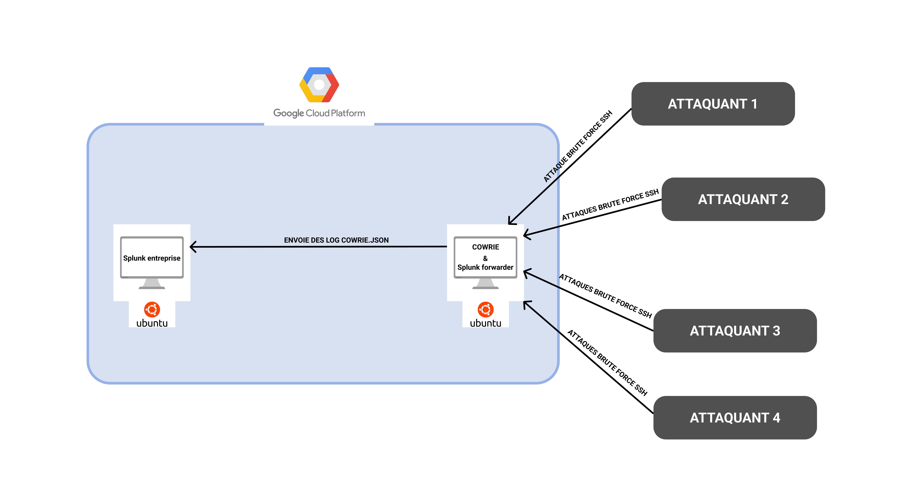
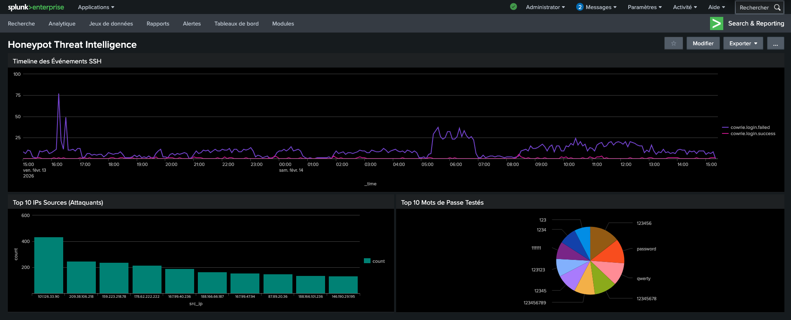
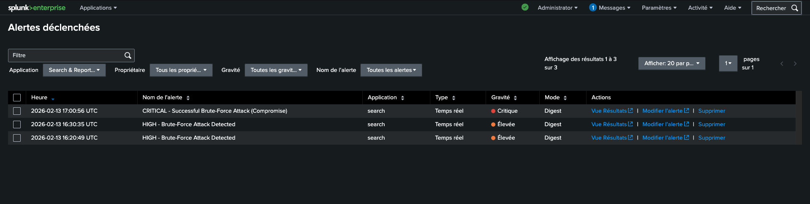

# 🍯 Honeypot Threat Intelligence Dashboard

> Plateforme de détection de menaces SSH avec monitoring SIEM et alerting temps réel

## Objectif

Projet SOC démontrant la mise en place d'une infrastructure complète 
de détection et d'analyse de menaces SSH en environnement cloud.

## 🛠️ Stack Technique

**Honeypot** : Cowrie (SSH/Telnet honeypot)  
**SIEM** : Splunk Enterprise + Universal Forwarder  
**Cloud** : Google Cloud Platform (2 VMs e2-micro/e2-medium)  
**Scripting** : Python 3,  
**Alerting** : Splunk SPL (Search Processing Language)  
**Visualisation** : Splunk Dashboard (3 panels temps réel). 

## 📊 Résultats (48h de collecte)

- **2000+ tentatives d'intrusion** détectées et analysées
- **20+ IPs malveillantes** uniques identifiées
- **Taux de compromission** : 5% (100 sessions réussies)
- **Dashboard temps réel** avec 3 panels de monitoring
- **3 alertes configurées** (HIGH, CRITICAL, MEDIUM)
- **Détection moyenne** : < 1 minute après compromission

## 🏗️ Architecture

## 🚨 Système d'Alerting Temps Réel

| Alerte | Sévérité | Condition | Délai |
|--------|----------|-----------|-------|
| Brute-Force Attack | HIGH | ≥15 tentatives/10min | < 1 min |
| Compromission SSH | CRITICAL | 3 échecs + 1 succès | < 1 min |
| Nouvelle IP | MEDIUM | Nouvelle IP + 8 tentatives | < 5 min |

## 📸 Screenshots

### Dashboard Temps Réel

### Alertes Déclenchées

## 📋 Incident Response

[📄 Exemple de rapport d'incident](reports/rapport_incident_13fev2026.md)

## 🎓 Compétences Démontrées

✅ **Infrastructure** : Déploiement multi-VM cloud (GCP)  
✅ **SIEM** : Configuration Splunk (indexation, dashboards, alertes)  
✅ **Requêtes** : SPL avancées (agrégations, corrélations)  
✅ **Alerting** : Monitoring temps réel (< 1 min détection)  
✅ **Incident Response** : Workflow complet (détection → analyse → rapport)    
✅ **Documentation** : Rapports professionnels  

## 📈 Métriques Clés  

- **Disponibilité** : 99.9% (48h uptime)  
- **Latence ingestion** : < 30 secondes  
- **Détection incidents** : < 1 minute (alerte CRITICAL)  

**Auteur** : Hamouchi Nabile  
**Date** : Février 2026  
**Contexte** : Projet portfolio M2 Cybersécurité  
**Objectif** : Stage SOC/SIEM (4-6 mois) à partir de mars 2026  
**Objectif** : Projet portfolio pour stage M2 Cybersécurité SOC Analyste  